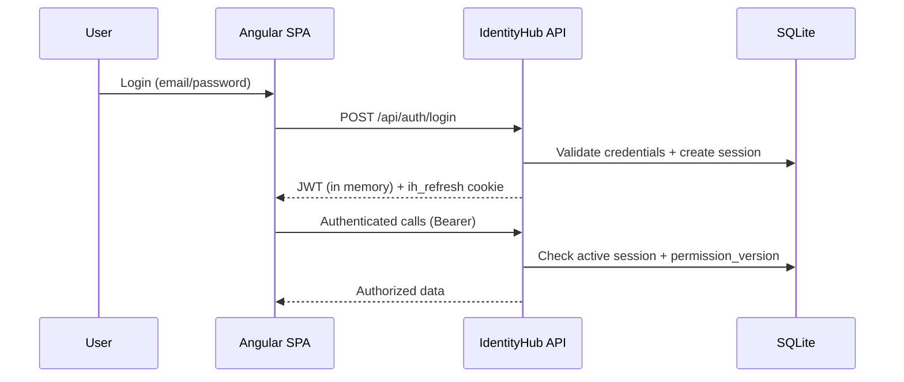
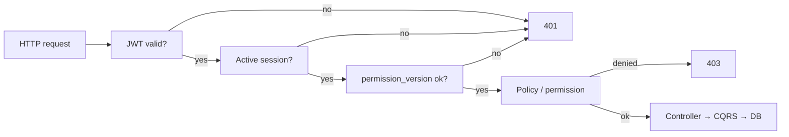
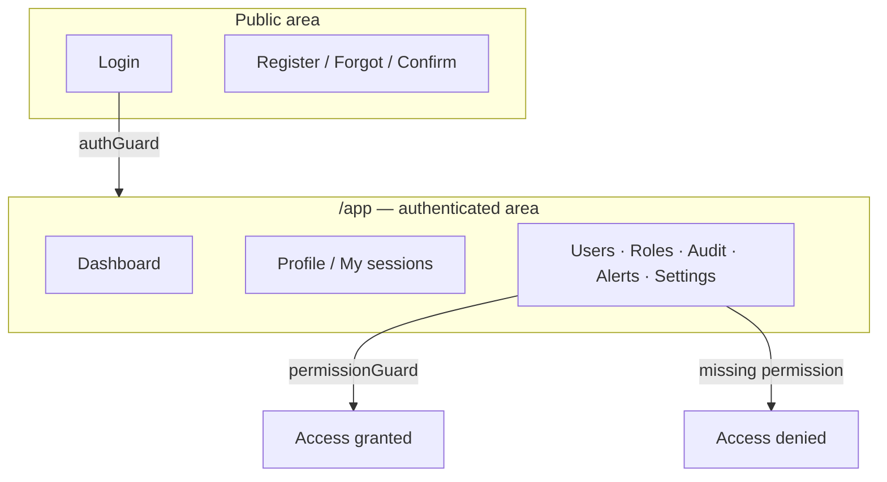

# IdentityHub

<p align="center">
  <!-- Badges style from https://github.com/alexandresanlim/Badges4-README.md-Profile -->
  
  
  
  
  
  
  
  
  
  
  
  
  
  
</p>

**IdentityHub** is an **identity and access** (IAM) platform: it manages people, controls what each person can do, and shows what happened in the system.

In short: **secure login + user/permission administration + audit**.

---

## What is this for?

| Goal | What you get |
|------|----------------|
| Full account lifecycle | Sign-up, email confirmation, password recovery, profile |
| Administration | Users, roles, permissions, and invites |
| Fine-grained security | Every screen/API requires a permission (e.g. `Users.View`) |
| Trustworthy sessions | Short-lived tokens, HttpOnly refresh cookie, session revoke |
| Visibility | Audit logs, security alerts, and recent activity |

Best suited for learning or evolving an internal identity admin panel — not a generic OAuth IdP (like Auth0), but an **identity administration hub** with API + SPA.

---

## Stack

| Layer | Technology |
|-------|------------|
| API | ASP.NET Core 10, Identity, JWT, MediatR/CQRS, FluentValidation |
| Data | Entity Framework Core + SQLite |
| Frontend | Angular 18 (standalone), Tailwind CSS, lazy-loaded routes |
| Tests | xUnit (API) · Karma/Jasmine (SPA) |

```
IdentityHub/
├── IdentityHubServer/          → .NET API (IdentityHub.slnx)
│   ├── IdentityHub.API
│   ├── IdentityHub.Application
│   ├── IdentityHub.Domain
│   ├── IdentityHub.Infrastructure
│   ├── IdentityHub.IoC
│   └── IdentityHub.API.Tests
└── IdentityHubClient/
    └── IdentityHub.APP/        → Angular SPA
```

---

## Get started in 3 steps

**Requirements:** [.NET 10 SDK](https://dotnet.microsoft.com/download) · [Node.js](https://nodejs.org/) (compatible with Angular 18)

### 1) API

```bash
cd IdentityHubServer/IdentityHub.API
dotnet user-secrets set "Jwt:Key" "your-long-random-jwt-key"
dotnet run --launch-profile https
```

### 2) Frontend

```bash
cd IdentityHubClient/IdentityHub.APP
npm install
npm start
```

### 3) Open

| Service | URL |
|---------|-----|
| SPA | http://localhost:4200 |
| API | https://localhost:7039 |
| Swagger | https://localhost:7039/swagger |

### Development seed accounts

| Email | Password | Role |
|-------|----------|------|
| `admin@identityhub.com` | `Admin@123` | Admin |
| `manager@identityhub.com` | `Manager@123` | Manager |
| `user@identityhub.com` | `User@123` | User |

> Seed runs only in Development/Testing. Change passwords before any public environment.

---

## Main flows

### Login and session



Key points:

- The **access token (JWT)** stays **in browser memory only**.
- **Refresh** uses the `ih_refresh` cookie (`HttpOnly`, `Secure`, `SameSite=Strict`).
- After a full reload, the SPA renews the access token from the cookie (`APP_INITIALIZER`).
- Unauthenticated deep links keep a safe `returnUrl`.

### Authenticated API request



### UI areas



Admin routes and secondary auth pages load on demand (`loadComponent`) to keep the initial bundle smaller.

---

## Useful commands

### Backend

```bash
cd IdentityHubServer

dotnet tool restore
dotnet build IdentityHub.slnx
dotnet test IdentityHub.API.Tests
```

Local secrets (SMTP optional for email):

```bash
cd IdentityHubServer/IdentityHub.API
dotnet user-secrets set "Jwt:Key" "your-long-random-jwt-key"
dotnet user-secrets set "Smtp:Username" "your-smtp-user"
dotnet user-secrets set "Smtp:Password" "your-smtp-password"
dotnet user-secrets set "Smtp:From" "no-reply@your-domain.com"
```

### EF Core migrations

The repo already includes `InitialCreate` under `IdentityHub.Infrastructure/Migrations`. Prefer applying the database. Only add a new migration when the model changes (use a new name).

#### CLI (VS Code, Visual Studio terminal, or any shell)

```bash
cd IdentityHubServer
dotnet tool restore

# Apply existing migrations
dotnet ef database update `
  --project IdentityHub.Infrastructure `
  --startup-project IdentityHub.API

# Create a new migration (only after model changes)
dotnet ef migrations add YourChangeName `
  --project IdentityHub.Infrastructure `
  --startup-project IdentityHub.API
```

#### Visual Studio 2026 (Package Manager Console)

1. Open `IdentityHubServer/IdentityHub.slnx` in **Visual Studio 2026**.
2. Set **IdentityHub.API** as the startup project (right-click → *Set as Startup Project*).
3. Open **Tools → NuGet Package Manager → Package Manager Console**.
4. In the PMC toolbar, set **Default project** to `IdentityHub.Infrastructure`.
5. Run:

```powershell
# Apply existing migrations
Update-Database -Project IdentityHub.Infrastructure -StartupProject IdentityHub.API

# Create a new migration (only after model changes)
Add-Migration YourChangeName -Project IdentityHub.Infrastructure -StartupProject IdentityHub.API
```

You can also run the `dotnet ef` CLI commands from **View → Terminal** inside Visual Studio 2026.

> If `InitialCreate` already exists, skip `Add-Migration` / `migrations add` and run only `Update-Database` / `database update`.

### Frontend

```bash
cd IdentityHubClient/IdentityHub.APP

npm install
npm start                 # http://localhost:4200
npm run build             # production + prerender
npm test                  # Karma/Jasmine
npm run serve:ssr:IdentityHub.APP
```

---

## What the app provides

### Account and authentication

- Register, email confirmation, resend, forgot/reset password  
- Login with rate limiting  
- Profile and password change  
- My sessions (revoke one or all others)  
- MFA is **not** implemented yet  

### Administration

- Users (CRUD, roles, sessions, per-user audit)  
- Roles and permissions (catalog validated via `AppPermissions`)  
- User invites  
- System sessions (global view)  
- Security settings (runtime)  
- Permissions matrix and catalog  

### Observability

- Audit logs (list, detail, CSV export)  
- Security alerts  
- Recent activity  

---

## Architecture (quick view)

| Layer | Responsibility |
|-------|----------------|
| **API** | Controllers, JWT, policies, Swagger, rate limiting |
| **Application** | Use cases (CQRS), validation, DTOs |
| **Domain** | Entities, permission constants |
| **Infrastructure** | EF Core, repositories, email, seed |
| **IoC** | Dependency registration |
| **SPA** | Standalone features + guards + lazy routes |

Main permission domains: `Users.*`, `Roles.*`, `Dashboard.View`, `Sessions.*`, `Activity.View`, `Audit.View`, `SecurityEvents.*`, `SecuritySettings.*`, `Permissions.*.View`, `UserInvites.*`.

---

## Quick access matrix

### API (summary)

| Area | Examples | Access |
|------|----------|--------|
| Public auth | `/api/auth/login`, `register`, `refresh`, forgot/reset | Anonymous |
| Authenticated auth | `/api/auth/me`, `sessions*`, `logout`, `profile` | Signed in |
| Users | `/api/users` | `Users.*` / `UserInvites.*` |
| Admin sessions | `GET/DELETE /api/sessions`, `DELETE /api/users/{id}/sessions` | `Sessions.View` / `Sessions.Revoke` |
| Roles | `/api/roles`, `/api/roles/{id}/permissions` | `Roles.*` |
| Audit / Alerts / Settings | `/api/audit-logs`, `/api/security-alerts`, `/api/security-settings` | Matching policies |

### Screens (`/app`)

| Route | Minimum permission |
|-------|--------------------|
| `/app/dashboard` | `Dashboard.View` |
| `/app/profile`, `/app/my-sessions`, `/app/my-access` | Authenticated |
| `/app/users` … | `Users.View` / `Create` / `Update` |
| `/app/roles` … | `Roles.View` / `Roles.Permissions.*` |
| `/app/audit-logs` | `Audit.View` |
| `/app/security-alerts` | `SecurityEvents.View` |
| `/app/sessions` | `Sessions.View` |
| `/app/activity` | `Activity.View` |
| `/app/security-settings` | `SecuritySettings.View` |
| `/app/user-invites` | `UserInvites.View` |
| `/app/permissions/*` | `Permissions.*.View` |

---

## API configuration

Base file: `IdentityHubServer/IdentityHub.API/appsettings.json`

| Key | Purpose |
|-----|---------|
| `ConnectionStrings:DefaultConnection` | SQLite (`identityhub.db`) |
| `Jwt` | Key, issuer, audience (lifetime prefers Security Settings) |
| `Frontend:BaseUrl` | SPA URL (email links) |
| `Smtp` | Confirmation/reset email |
| `RateLimiting:Auth:*` | Limits for login / forgot / resend |

Migrations apply automatically on startup (except `Testing`). Seed runs only in Development/Testing.

---

## Checklist for new features

1. Add the permission in the backend (`AppPermissions`) and frontend catalogs  
2. Protect the endpoint with the matching policy  
3. Protect the Angular route (`permission` + guard)  
4. Update navigation (`requiredAny`)  
5. Cover with tests (authorization / integration)  
6. Update this README if the public surface changes  

---

## Security notes

- Do not commit JWT, SMTP, or secrets  
- Change seed users before deploy  
- Current model: access token in memory + HttpOnly refresh  
- Permission changes invalidate tokens via `permission_version`  
- Sensitive endpoints always use `[Authorize]` + policy  

**Known gaps:** MFA is not implemented; the frontend may still report Angular 18 advisories — plan an upgrade when it becomes a priority.

---

## License

[MIT](LICENSE.txt) © Pedro Henrique Lustosa e Silva
