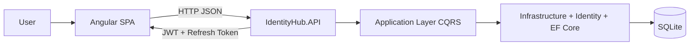

# IdentityHub - Project Flows and Screens

## 1. Purpose of this document

This document provides a practical, implementation-aligned view of:

- what the project does end to end;
- which user flows are supported;
- which screens exist in the SPA;
- which API endpoints and permissions back each screen/flow.

It complements `docs/system-objective-and-flows.md` with a UI-first catalog of routes and screens.

---

## 2. Solution overview

IdentityHub is split into two main applications:

- **Frontend:** Angular SPA (`IdentityHubClient/IdentityHub.APP`) with standalone components, guarded routes, JWT-based session handling, and role-aware UI actions.
- **Backend:** ASP.NET Core Web API (`IdentityHubServer/IdentityHub.API`) with Identity + JWT auth, policy-based authorization, CQRS handlers, and SQLite persistence.

High-level runtime flow:

---

## 3. Navigation model and layouts

### 3.1 Route groups

The SPA route map is centered around two layout trees:

- **Public/Auth layout** (`path: ""`): login and account recovery/activation flows.
- **Authenticated/App layout** (`path: "app"`): dashboard and administration flows.

### 3.2 Guards

- **`authGuard`** protects `/app/**` routes.
- **`guestGuard`** prevents signed-in users from opening login/register/recovery entry pages.

### 3.3 Authenticated shell

The authenticated layout contains:

- left sidebar navigation: **Dashboard**, **Users**, **Role claims**;
- top navbar user menu with **Profile** and **Logout**.

---

## 4. Screen catalog

## 4.1 Public/Auth screens

| Screen | Route | Main purpose | Main actions | Primary API calls |
|---|---|---|---|---|
| Login | `/login` | Start authenticated session | Sign in, optional remember-me | `POST /api/auth/login` |
| Register | `/register` | Create account | Register user, redirect to login with prefilled email | `POST /api/auth/register` |
| Forgot password | `/forgot-password` | Request reset instructions | Submit account email | `POST /api/auth/forgot-password` |
| Reset password | `/reset-password?email=...&token=...` | Set new password using reset token | Submit new password + confirmation | `POST /api/auth/reset-password` |
| Confirm email | `/confirm-email?email=...&token=...` | Activate account email | Validate token and confirm email | `GET /api/auth/confirm-email` |
| Resend confirmation | `/resend-confirmation` | Resend email activation link | Submit email to resend confirmation | `POST /api/auth/resend-confirmation` |

## 4.2 Authenticated/App screens

| Screen | Route | Main purpose | Main actions | Primary API calls |
|---|---|---|---|---|
| Dashboard | `/app/dashboard` | Show identity/usage metrics | Load and refresh dashboard cards | `GET /api/dashboard` |
| Users list | `/app/users` | Browse users and quick role preview | Open detail/edit pages | `GET /api/users` |
| User detail | `/app/users/:id` | Inspect one user | Navigate to edit | `GET /api/users/{id}` |
| User edit | `/app/users/:id/edit` | Update profile and role memberships | Save user core data and roles | `PUT /api/users/{id}`, `PUT /api/users/{id}/roles` |
| Role claims list | `/app/role-claims` | Browse roles with permission count | Open detail/edit per role | `GET /api/roles`, `GET /api/roles/{id}/permissions` |
| Role claims detail | `/app/role-claims/:roleId` | Inspect role permissions | Navigate to edit | `GET /api/roles/{id}`, `GET /api/roles/{id}/permissions` |
| Role claims edit | `/app/role-claims/:roleId/edit` | Change permissions assigned to a role | Toggle permissions and save | `PUT /api/roles/{id}/permissions` |
| Profile | `/app/profile` | Self-service account maintenance | Update full name, change password | `PUT /api/auth/profile`, `POST /api/auth/change-password`, `POST /api/auth/refresh` |

Notes:

- `/app/change-password` redirects to `/app/profile`.
- `/app/home` redirects to `/app/dashboard`.

---

## 5. End-to-end flows

## 5.1 Sign-in and session start

1. User opens **Login**.
2. Credentials are submitted to `POST /api/auth/login`.
3. API returns access token + refresh token.
4. Frontend stores tokens (localStorage or sessionStorage based on remember-me).
5. User is redirected to `/app/dashboard`.

## 5.2 Token refresh and session continuity

1. Client refresh flow calls `POST /api/auth/refresh` with current refresh token.
2. API validates token state (exists, not revoked, not expired).
3. API returns a new access token and rotates refresh token.
4. Frontend updates stored tokens.

## 5.3 Logout

1. User clicks **Logout** from the top navbar.
2. SPA posts refresh token to `POST /api/auth/logout`.
3. API revokes token only if it belongs to the authenticated user.
4. SPA clears client session and returns to `/login`.

## 5.4 Registration and email confirmation

1. User registers via **Register**.
2. API creates user and sends confirmation link.
3. User opens **Confirm email** route with query params.
4. API validates token and confirms email.

## 5.5 Password recovery

1. User requests recovery on **Forgot password**.
2. API sends reset link.
3. User opens **Reset password** with query params.
4. API validates token and updates password.
5. Existing sessions/tokens are invalidated server-side.

## 5.6 User administration

1. Admin/authorized user opens **Users** list.
2. Selects user detail/edit.
3. Saves profile state (`PUT /api/users/{id}`) and optionally role membership (`PUT /api/users/{id}/roles`).

## 5.7 Role permission governance

1. User opens **Role claims** list to inspect permission counts.
2. Opens role detail or edit.
3. In edit screen, toggles permissions from catalog and saves.
4. API persists through `PUT /api/roles/{id}/permissions`.

## 5.8 Self profile management

1. User opens **Profile** from navbar menu.
2. Updates full name (email shown read-only in UI) via `PUT /api/auth/profile`.
3. SPA tries to refresh session after profile update to keep token claims aligned.
4. Password change triggers sign-out flow and new login requirement.

---

## 6. Authorization and permission model in UI/API

The backend enforces policy-based access. Core permissions used by user/role/dashboard screens:

- `Users.View`
- `Users.Create`
- `Users.Update`
- `Users.Delete`
- `Users.Roles.Update`
- `Roles.View`
- `Roles.Create`
- `Roles.Update`
- `Roles.Delete`
- `Roles.Permissions.View`
- `Roles.Permissions.Update`
- `RoleClaims.View`
- `RoleClaims.Manage`
- `Dashboard.View`

UI behavior is also role-aware for sensitive actions (for example, permission assignment in role edit screens is restricted to Admin role in the SPA logic).

---

## 7. API contract and response behavior relevant to screens

- Auth endpoints now map domain results to meaningful HTTP statuses (`400`, `401`, `403`, `404`) via result-to-action mapping.
- DTO inputs use DataAnnotations for server-side validation on key auth/user/role requests.
- Invalid token format in confirm/reset flows returns controlled client-facing errors instead of unhandled exceptions.

---

## 8. Testing coverage snapshot for flows

The API test suite currently includes:

- authorization attribute checks for Users/Roles/Auth actions;
- integration tests for authentication flows such as:
  - login success;
  - refresh success;
  - refresh with revoked token (`401`);
  - logout with another user token (`403`);
  - confirm-email invalid token format (`400`);
  - confirm-email non-existing user (`404`);
  - reset-password invalid token format (`400`);
  - reset-password non-existing user (`404`).

---

## 9. Suggested maintenance checklist for this document

Update this file when any of the following changes:

- route paths or guards;
- screen additions/removals;
- API endpoint contracts per screen;
- permission names/policies;
- major flow behavior (auth, profile, user admin, role governance).
