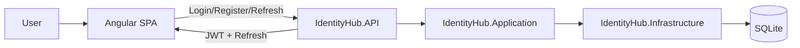

# IdentityHub - System Objective and Flows

## 1. System Objective

IdentityHub is a centralized identity and access control platform for internal systems.
Its primary objective is to allow administrators to manage users, roles, and permissions in a standardized, auditable, and secure way.

## 2. Problem It Solves

Without a central hub, each application usually ends up with:

- inconsistent access rules;
- duplicated user provisioning processes;
- difficult access revocation;
- limited visibility into who can do what.

IdentityHub centralizes these responsibilities and provides a single foundation for authentication and authorization.

## 3. Functional Scope

The system covers the following pillars:

- JWT authentication and refresh token flow;
- user lifecycle management;
- role management;
- permission assignment per role (permission claim);
- self profile update;
- password change;
- dashboard metrics visualization.

## 4. Actors

- Administrator: manages users, roles, and sensitive permissions.
- Manager: has operational visibility with restricted modification capabilities.
- Standard user: limited access based on assigned roles and inherited permissions.

## 5. Authorization Model

Authorization is policy-driven, based on permission claims in the token.

- APIs enforce [Authorize] and [Authorize(Policy = "...")].
- PermissionPolicyProvider creates dynamic policies using the required permission name.
- PermissionHandler validates whether the authenticated user has the required claim.

Practical rule: roles define claims, claims define allowed operations.

## 6. Application High-Level Flow

## 7. Main Flows

### 7.1 Initial Access and Login

1. The user opens a public screen (login/register).
2. The SPA sends credentials to POST /api/auth/login.
3. The API validates credentials through Identity and returns token plus refreshToken.
4. The SPA stores tokens in localStorage or sessionStorage, depending on remember-me.
5. Authenticated requests include Authorization: Bearer <token>.

Outcome: active session and access to /app routes.

### 7.2 Session Renewal (Refresh)

1. An authenticated request returns 401.
2. The refresh interceptor calls POST /api/auth/refresh with the refresh token.
3. If successful, tokens are updated and the original request is retried.
4. If refresh fails, the session is cleared and the user is redirected to login.

Outcome: seamless session continuity.

### 7.3 User Management

1. A user with Users.View lists users through GET /api/users.
2. A user with Users.Create creates a new user through POST /api/users.
3. A user with Users.Update updates user data through PUT /api/users/{id}.
4. A user with Users.Delete removes a user through DELETE /api/users/{id}.
5. A user with Users.Roles.Update updates role membership through PUT /api/users/{id}/roles.

Outcome: centrally managed user lifecycle.

### 7.4 Role and Permission Management

1. Roles are listed and maintained via /api/roles.
2. Role permissions are read with GET /api/roles/{id}/permissions.
3. Role permissions are updated with PUT /api/roles/{id}/permissions.
4. A technical alternate flow also exists under /api/role-claims/{roleId}.

Outcome: access governance is centered on roles rather than direct per-user permission assignment.

### 7.5 Dashboard

1. An authenticated user with Dashboard.View calls GET /api/dashboard.
2. The API aggregates metrics (totals, time windows, growth) and returns a DTO.
3. The SPA maps and renders the data in the dashboard UI.

Outcome: executive visibility into user and access activity.

### 7.6 Profile and Password

1. An authenticated user opens /app/profile.
2. The user updates profile data through PUT /api/auth/profile.
3. The user changes password through POST /api/auth/change-password.

Outcome: self-service profile and credential maintenance.

### 7.7 Logout

1. The SPA calls POST /api/auth/logout with the current refresh token.
2. The API invalidates or closes the related server session.
3. The client clears tokens and redirects to login.

Outcome: complete sign-out on both client and server sides.

## 8. Boundaries and Responsibilities

- Frontend (Angular): user experience, form validation, routing, local session state, HTTP interception.
- API (ASP.NET Core): business rules, authentication, policy-based authorization, endpoint exposure.
- Application: use-case orchestration, interfaces, and application contracts.
- Infrastructure: persistence, Identity integration, EF Core, and seed data.

## 9. Expected Business Outcome

With IdentityHub in operation, the organization should be able to:

- provision access faster with standardized flows;
- reduce risk of excessive privileges;
- improve traceability of granted permissions;
- decouple authentication and authorization from consuming applications.

## 10. Value Flow Summary

1. Admin defines roles and permissions.
2. Admin creates users and assigns roles.
3. Users authenticate and receive tokens with claims.
4. The API allows or blocks operations through policies.
5. Operations are observed through dashboard and administrative controls.

This loop closes identity governance end to end.
